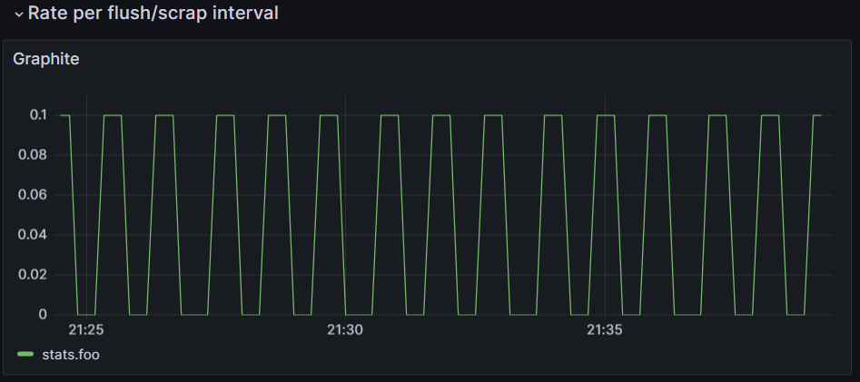
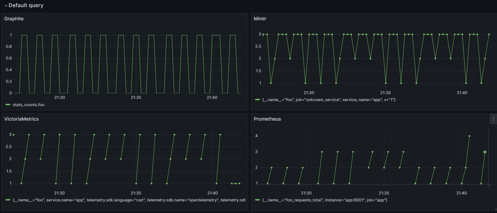
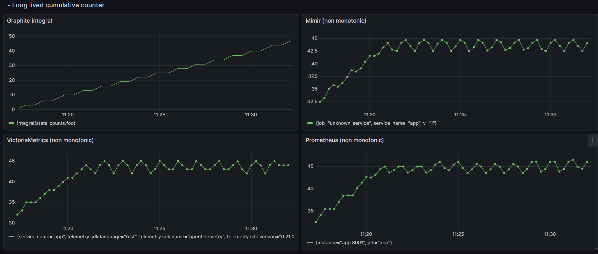
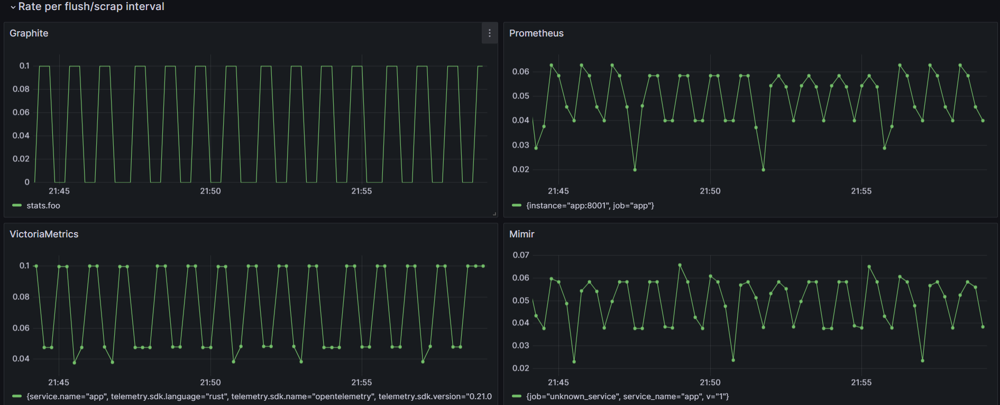
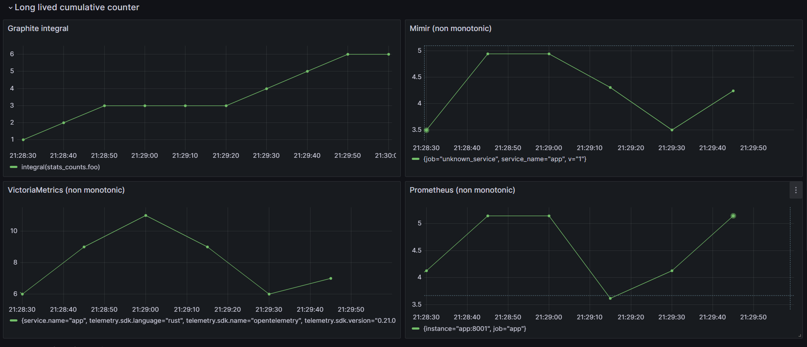

# monotonicity demo

## TL;DR
Rates are essential to support monitoring and alterting while long lived cumulative counters can be useful for business KPI and can be approximated (approximated resolution for cumulative model) or partially exact (data loss for delta model).

The cumulative model trade-offs are not really compatible to support exact counters due to non monotonic issue and data loss.

This demo illustrate those trade-offs for observability.

## Context
Run the docker compose demo with prometheus and an app to increment a counter.

Every 10s (prometheus scrap interval, statsd and otlp flush) , the metric is scrapped and a counter increases by 1 each time.

Every 30s, the app is stopped for 30s and restart.

The counter increases by 3 per minute which is (30s / 10s) and the rate should be between from 0 to 0.1rps.



This demo emphasises the restart and reset/state management issue on pull + cumulative based metrics.

1/ Run docker compose
```bash
./run.sh
```
2/ Open in a brower the [grafana graphs](http://localhost:3000/d/f121c72d-d858-44bc-9a1e-adf869509b38/monotonicity?orgId=1)

## Architecture
- app : a rust app which sends metrics with statsd / prometheus and otlp specs. A webserver serves prometheus metrics.
- prometheus : [scraps every 10s](./prometheus/prometheus.yml) the app which increases app counter
- OpenTelemetry Collector contrib collector receives otlp metrics from the app and sends it to mimir and victoriametrics
- [Grafana](http://localhost:3000/d/f121c72d-d858-44bc-9a1e-adf869509b38/monotonicity?orgId=1) and [Prometheus](http://localhost:9090/graph?g0.expr=foo_requests_total&g0.tab=0&g0.stacked=0&g0.show_exemplars=0&g0.range_input=5m&g1.expr=increase(foo_requests_total%5B1m%5D)&g1.tab=0&g1.stacked=0&g1.show_exemplars=0&g1.range_input=5m&g2.expr=rate(foo_requests_total%5B1m%5D)&g2.tab=0&g2.stacked=0&g2.show_exemplars=0&g2.range_input=5m) are used as a data visualization webserver.
- Cumulative backends : VictoriaMetrics (with prometheus datasource), Prometheus, Mimir.
- Delta backends : graphite.


## Graph visualization comparison
### Default Queries
Those graphs show raw metric.


### Long lived cumulative counter
Only graphite offers a reliable long lived cumulative counter.

Data can be lost and as mentioned by the prometheus team : 
>"Prometheus values reliability. You can always view what statistics are available about your system, even under failure conditions. If you need 100% accuracy, such as for per-request billing, Prometheus is not a good choice as the collected data will likely not be detailed and complete enough. In such a case you would be best off using some other system to collect and analyze the data for billing, and Prometheus for the rest of your monitoring."

Reference : 
- [When does Prometheus fit?](https://prometheus.io/docs/introduction/overview/#when-does-it-fit)
- [When does Prometheus not fit?](https://prometheus.io/docs/introduction/overview/#when-does-it-not-fit)

>"Prometheus offers a richer data model and query language, in addition to being easier to run and integrate into your environment. If you want a clustered solution that can hold historical data long term, Graphite may be a better choice."

Reference: 
- [Prometheus comparison](https://prometheus.io/docs/introduction/comparison/#summary)


It seems that supporting such property is a hard topic for cumulative based backend according to [Grafana](https://grafana.com/blog/2023/09/26/opentelemetry-metrics-a-guide-to-delta-vs.-cumulative-temporality-trade-offs/).




### Rates
For observability, rates are really important but it is important to understand how the datapoint can be approximated.



## Conclusion

Using rates is the best way to properly view metrics on cumulative/pull based metrics model.

Grafana helps to have an approximated integral (non monotonic) by using : `increase(foo[$__range])` `increase` over a range vector of `$__range`.

To continue with the [main post conlusion](../README.md#demo)


