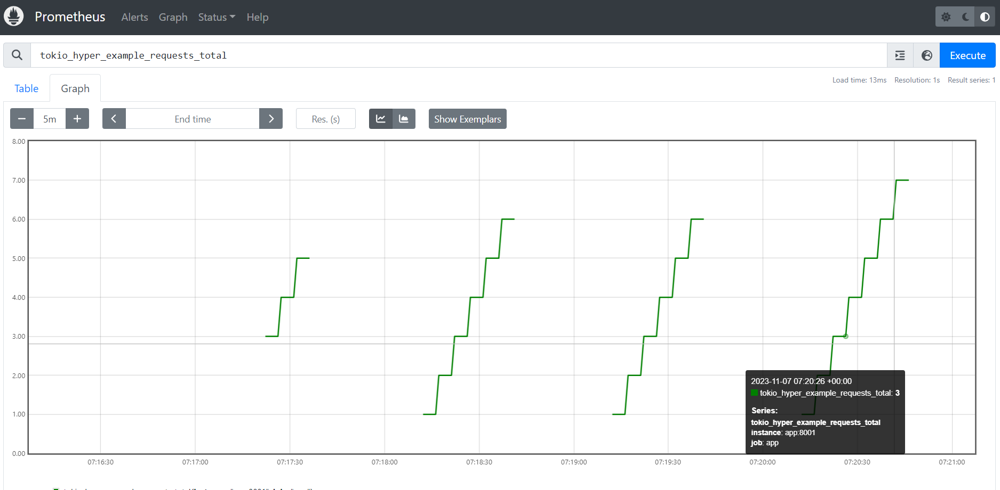

# monotonicity demo

## Context
Run the docker compose demo with prometheus and an app to increment a counter.

Every 5s (prometheus scrap interval) , the metric is scrapped and a counter increases by 1 every time.

Every 30s, the app is stopped for 30s and restart.

The counter increases by 6 per minute which is (30s / 5s) and the rate should be closed to 0.1rps (6/60s).

This demo emphasises the restart and state management issue on pull + cumulative based metrics.

```bash
./run.sh
```

The prometheus graphs which includes instant vector

open in a brower [prometheus graphs](http://localhost:9090/graph?g0.expr=tokio_hyper_example_requests_total&g0.tab=0&g0.stacked=0&g0.show_exemplars=0&g0.range_input=5m&g1.expr=increase(tokio_hyper_example_requests_total%5B1m%5D)&g1.tab=0&g1.stacked=0&g1.show_exemplars=0&g1.range_input=5m&g2.expr=rate(tokio_hyper_example_requests_total%5B1m%5D)&g2.tab=0&g2.stacked=0&g2.show_exemplars=0&g2.range_input=5m)

## Queries

Using rates is the best way to properly view metrics on cumulative/pull based metrics model.

### Instant Vector
As soon as the app restarts, the counter is discontinue and no more monotonic


### Range Vector increase
Viewing a 1mn range of the metrics is better but the counter looks weird 


### Range Vector rate
The metrics is close to the expected 0.1rps but still rounded due to the number of restart
