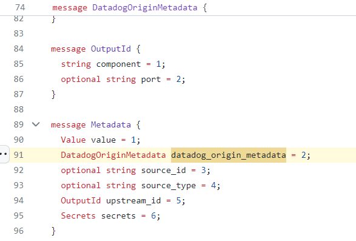

# 2023-11-16 #5 Meet Vector

This week, [Vector.dev](https://vector.dev/) from DataDog will be deeply analyzed.

## History
- 2018 : [vector is born](https://github.com/vectordotdev/vector/commit/83705cb791254b331b27f7719f5adae083ac3b13) and written in rust.
- 2021 : [DataDog acquires Vector and Timber technologies](https://www.datadoghq.com/blog/datadog-acquires-timber-technologies-vector/)

Since vector has been acquired by DataDog, it turns out that vector is more focused on gateway than agent to be used as a pipeline ([Directed Acyclic Graph: DAG](https://vector.dev/docs/about/under-the-hood/architecture/pipeline-model/))

## License
[Mozilla Public License 2.0](https://github.com/vectordotdev/vector/blob/master/LICENSE)

## When to use it ?

Vector can replace several agent on the server
https://vector.dev/docs/setup/going-to-prod/architecting/#1-use-the-best-tool-for-the-job

https://vector.dev/docs/setup/going-to-prod/architecting/#choosing-agents

## Concept

Component: source or transform or sink, it is a component of the pipeline (this notion is largely used when monitoring vector per component id)

Vector supports multiple [sources](https://vector.dev/docs/reference/configuration/sources/) and [sinks](https://vector.dev/docs/reference/configuration/sinks/) like logstash, prometheus, files, loki, elastic, ...

One of the big feature of vector is the [transforms](https://vector.dev/docs/reference/configuration/transforms/) component.

### Transforms
[Transforms](https://vector.dev/docs/reference/configuration/transforms/) is a [Directed Acyclic Graph (DAG)](https://vector.dev/docs/about/under-the-hood/architecture/pipeline-model/) oriented solution and help transforming teleemetry data to add more tags, filtering or simply transform signal to another one like log to metric.

#### Pipeline Graph
Vector CLI has a [`graph`](https://vector.dev/docs/reference/cli/#graph) command which is pretty handy to visualize the pipeline. In DataDog, it is possible to see the telemetry over the graph for instance.

Here is the vector log_2_metric pipeline graph for the next week vector demo:


#### Vector Remapping language

Vector is written in rust and the VRL module is available on [crates.io](https://crates.io/crates/vrl)

[OpenObserve](https://github.com/openobserve/openobserve/blob/main/Cargo.toml#L164) took the opportunity to reuse subpart of vector to build a different backend than DataDog which is very interesting and can be analyzed deeper through another post.

### Configuration
It is possible to use json, toml or cue file formats.

The configuration can be splitted like this way as example:
- vector.toml : global configuration
- sinks.tml
- XXX.toml: one file per pipeline and test
- dlq.tml: one config file for the dead letter queue configuration

### Data directory
Vector is a statefull component depending the source transforms and sink used and a [data directory](https://vector.dev/docs/reference/configuration/global-options/#data_dir) is used to store the vector state

The [file source uses the data directory](https://vector.dev/docs/reference/configuration/sources/file/#data_dir) to store checkpoint positions

### I/O Telemetry Compatibility
sources (input) and sinks (output)

| Protocol | Input | Output |
|-|-|-|
|OTLP metric|||
|OTLP log|X||
|OTLP trace|||
|vector|X|X|
|datadog|X|X|

One of the strange things is that many DataDog competitors are available as sinks but OTLP is not fully supported as input and no OTLP sink is available which is a blocker for using vector as gateway with OTLP.

### Error Handling
[VRL is a fail-safe](https://vector.dev/docs/reference/vrl/errors/) language meaning that errors should be treated and are statically verified during the vrl setup and vector startup.

```vrl
. |= parse_key_value!(.message, field_delimiter:"\t", accept_standalone_key:false)
.timestamp = parse_timestamp!(.t, "%Y-%m-%dT%H:%M:%S%.f%:z")
.job = "vector"
del(.message)
```

`.message` is the raw message which can be parsed.

1/ parse message as key value and put the object at root level (dot) `.`. The parse_key_value returns a result which can be the object or an error. the bang `!` operator is used to fail on error.
2/ Add a field `timestamp` by parsing and fail if there is an error
3/ Add `job` field to vector
4/ Remove `message` to avoid paying twice raw and structured signal.

Pay close attention that this program will fail on error meaning that vector will stop on error.

It is also possible to handle errors in vrl but it comes at repeating the same error handling every time.

Instead of failing vector on error, it is also possible and recommended to drop on error so that vector will not fail at all and the message is not lost but reroute.

```toml
[transforms.applog_file]
type = "remap"
inputs = ["applog_file_raw"]
file = "config/vrl/keyvalue.vrl"
# forward to a dead letter queue on error or abort 
drop_on_error = true
drop_on_abort = true
reroute_dropped = true
```

All dropped messages are available with the `.dropped` input suffix.

Here is the associated loki sink to forward all [dropped messages](https://vector.dev/highlights/2021-11-18-failed-event-routing/).

```toml
## dead letter queue for dropped messages
[sinks.dlq_loki]
type = "loki"
endpoint = "http://loki:3100"
inputs = ["*.dropped"]
encoding = { codec = "json" }
labels = { application = "dead-letter-queue", host="{{ host }}", pid="{{ pid }}" }
```

### TDD

One of the concept of vector is the ability to test a transformation pipeline.

It becomes really easy to fix a breaking changes during a parsing failure.

This command runs vector inside docker to test the pipeline

```bash
docker run --rm -w /vector -v $(pwd):/vector/config/ timberio/vector:0.34.0-debian test --config-toml /vector/config/**/*.toml
```

### Monitoring Vector
Vector is really well instrumented and [grafana dashboards](https://grafana.com/grafana/dashboards/19649-vector-monitoring/) are avaible to monitor it properly.

The [Vector Monitoring dashboard](https://grafana.com/grafana/dashboards/19649-vector-monitoring/) exposes all the telemetry data available while depending the vector integration, only a subpart is really useful.

## Vector as Node exporter (host metrics)
Vector as a [`host_metric`](https://vector.dev/docs/reference/configuration/sources/host_metrics/) source which can be a node exporter drop-in solution.

The [Node exporter dashboard for vector](https://grafana.com/grafana/dashboards/19650-node-exporter-vector-host-metrics/) is a compatible node exported dashboard for vector host_metric.

### Agent communication
Agent communication is an important topic to understand when talking about observability agent.
Vector uses its own gRPC protocol between agents/gateways. 
- [vector event model proto](https://github.com/vectordotdev/vector/blob/master/lib/vector-core/proto/event.proto)
- [vector service proto (push model with EventWrapper)](https://github.com/vectordotdev/vector/blob/master/proto/vector.proto)
proto vector spec vs otlp proto spec

Instead of using an external standard, vector has a internal protocol which can create incompatibility and [OTLP integration issues](https://github.com/vectordotdev/vector/issues/1444#issuecomment-1704040812).

It seems that log and metrics are really well integrated but tracing has a limited support and only available for datadog since the only trace sink available is the [datadog traces sink](https://vector.dev/docs/reference/configuration/sinks/datadog_traces/).

Again, 3 protocols has to be synced (vector, datadog and OTLP) which is a complex problem when there is alignment issues.

The [vector protocol contains specific DataDog metadata](https://github.com/vectordotdev/vector/blob/master/lib/vector-core/proto/event.proto#L91) which can be strange from the standard point of view.



The context history can help to understand the trade-off. It seems that the vector team did not use or see the benefits of using opentracing or opentelemetry to [serialize telemetry to disk](https://github.com/vectordotdev/vector/pull/81).

- 2015/11: [opentracing spec first commit](https://github.com/opentracing/opentracing-go/commit/eab1a36e622e49f29d348dc39bc03730ae228b72)
- 2017/01: [opencensus instrumentaion first commit](https://github.com/census-instrumentation/opencensus-go/commit/304ea252d1c39e8aecc84d1bb608c806ff25bfb3)
- 2018/09: [vector initial commit](https://github.com/vectordotdev/vector/commit/83705cb791254b331b27f7719f5adae083ac3b13)
- 2019/05 : [opencensus](https://opencensus.io/) jaeger tracing, [opentracing](https://github.com/opentracing/opentracing-go) merged to [opentelemetry spec + instrumentation](https://github.com/open-telemetry/opentelemetry-java/pull/244)
- 2019/02: birth of [vector protocol](https://github.com/vectordotdev/vector/pull/81) which is the main communication protocol between agents and gateway at the time of writing.
- 2021 : [Datadog acquires vector](https://www.datadoghq.com/blog/datadog-acquires-timber-technologies-vector/)

Internally, DataDog has built a UI over vector + aggregated telemetry over vector graphs

## Conclusion

Vector is good at log and metric pipeline transformation and really well integrated with DataDog.

Vector is best at pipeline transformation like log to metric transformation / aggregation while it does not support nor full OTLP and traces. Vector uses its own protocol which can conflict with OTLP (ie: OTLP trace). 

Its compatibility outside DataDog is limited to log and metric 

How about a true opentelemetry based vector ?

### Strength

+ Safe error handling
+ [Documentation](https://vector.dev/docs/about/under-the-hood/)
+ Resiliency
+ Data Durability see [buffer](https://vector.dev/docs/about/under-the-hood/architecture/buffering-model/#disk-buffers)

### Weakness

- OTLP support / Vector <> OTLP conversion and alignment issues : [partial OTLP support](https://github.com/vectordotdev/vector/issues/1444#issuecomment-1704040812)
- Datadog vendor locking : [vector protocol DataDog leak](https://github.com/vectordotdev/vector/blob/master/lib/vector-core/proto/event.proto#L91)

## What next ?
Next week, a full vector hands-on will be available to see its strength