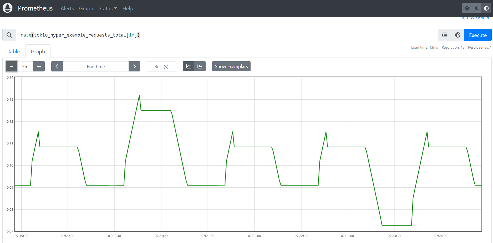

# 2023-11-16 #4 Monotonicity

This week, a [prometheus demo](./demo/README.md) has been made to illustrate this post. 

## TL;DR
It is recommended to use rates / gauge for cumulative metrics and it fits really well with system monitoring while delta metrics is good at best effort long lived monotonic counters with potential data loss.  

Observability tools come with embedded trade-offs, it is difficult to combine simplicity, low overhead / precision / availability and perfect reliability.

Depending the solution, in worst case, a part of the data can be lost or approximated to support a global overview of the system.

For instance, it is impossible to build a billing system based on prometheus or graphite counters. In worst case the precision is impacted and the system cannot support such properties. 

The trade-offs is that for the sake of the simplicity and availibility, the data is temporary not fully relialable but can still be used to have a global overview of the monitored system.

Graphite, prometheus and including victoria metrics, grafana mimir are great metrics tools but it is important to keep in mind the associated trade-offs to avoid mistakes. 

Prometheus documents this really well in the intro : 
- [When does it fit?](https://prometheus.io/docs/introduction/overview/#when-does-it-fit)
- [When does it not fit?](https://prometheus.io/docs/introduction/overview/#when-does-it-not-fit)

"Prometheus values reliability. You can always view what statistics are available about your system, even under failure conditions. If you need 100% accuracy, such as for per-request billing, Prometheus is not a good choice as the collected data will likely not be detailed and complete enough. In such a case you would be best off using some other system to collect and analyze the data for billing, and Prometheus for the rest of your monitoring."

The good news is that [OTLP metrics supports delta/cumulative](https://opentelemetry.io/docs/specs/otel/metrics/data-model/#timeseries-model)

## Prometheus Demo

[Run the Demo](./demo/README.md)

Using rates is the best way to properly view metrics on cumulative/pull based metrics model and avoid resets trap.

The demo expect a rate at 0.1rps.

### Instant Vector
As soon as the app restarts, the counter is no more monotonic on reset.

### Range Vector increase
Viewing a 1mn range of the metrics is better but the counter looks weird due to resets.

### Range Vector rate
The metric is close to the expected 0.1rps but still rounded due to the number of restart.

## Cumulative vs Delta

Prometheus is cumulative, the counter increases on the app side locally and pulled later by prometheus.

As opposed to StatsD / Graphite where the delta is pushed to StatsD, aggregated every 10s/1m and pushed to graphite.

An observability outage occurs at T52 on network.

| | T0 | T1 | T2 | T50 | T51 | T52 | Total | Rate
|-|-|-|-|-|-|-|-|-|
| Cumulative | 0 | 1 | 2 | 50 | 1 | X | 1 | 1 |
| Delta | 1 | 1 | 1 | 50 | 1 | X | 51 | 0.9 |

The Delta model can support easily eventual consistency, is associative and comutative, the total is simply the sum of the datapoint which forms a monoid. In this mode, the counter can still be approximated and partial due to potential data loss during observability backend issues.

The cumulative and pull model are tolerant to observability backend issues, the counter state is stored directly in the app memory. As soon as the app restarts, the counter down to 0 and monotonicity is impacted. Rates can still be used though.

## Pull vs Push

Pull model is relialable in case of outage, the data is not lost but the backend part should deal with reset.

Push model is less relialable in case of outage and metrics should be packed together and lost together to be still approximated relialable.

A gateway/aggregator which can support push and pull can help to mitigate this problem.

If the data should not be lost in case of outage, a stream/message oriented middleware like kafka should be in place with higher SLA than the monitored system which impact the simplicity.

## Losing data
When data is lost, it is important to understand how they are used.

Let's image using a delta model where rate is calculated with 2 metrics sum (total time) and count: sum / count

If only one counter is lost during an outage, the rate is not reliable anymore.

In such case, sum and count should be located inside the same udp paket so that the overhall rate is not impacted while the amount of packet lost is neglectable.

# OTLP metric

OTLP supports both cumulative and delta model and is pushed first but still can be used with OTLP/json to flush to disk and pull later. 

Reference: 
- [OTLP protocol / Aggregation Temporality](https://github.com/open-telemetry/opentelemetry-proto/blob/main/opentelemetry/proto/metrics/v1/metrics.proto#L252)
- [OTLP / Timeseries Model](https://opentelemetry.io/docs/specs/otel/metrics/data-model/#timeseries-model)