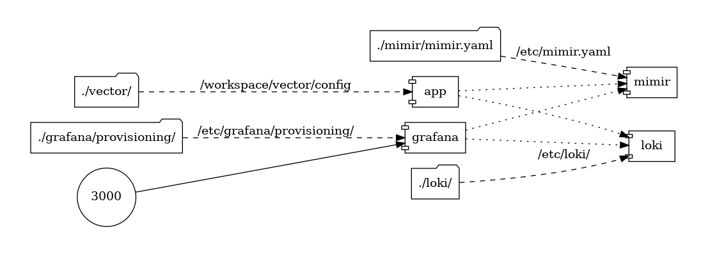
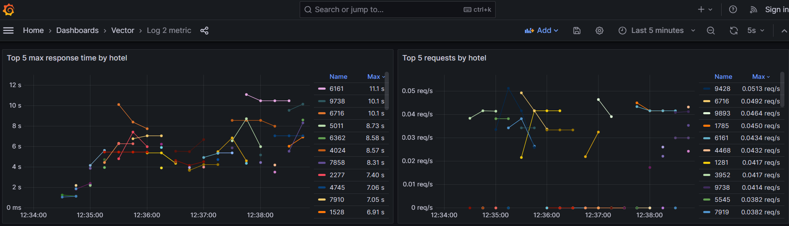
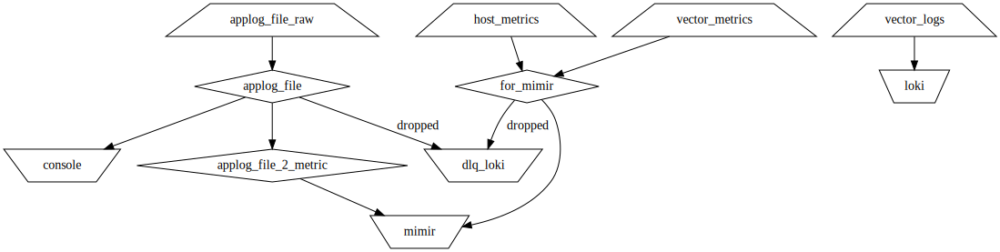
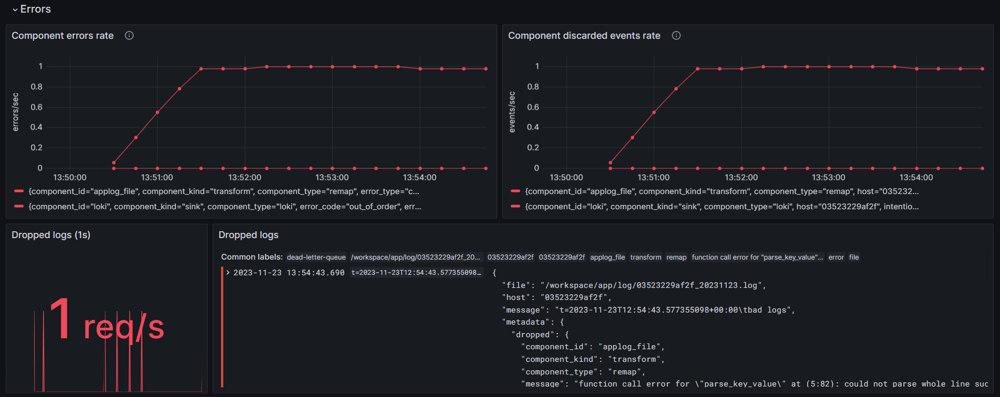
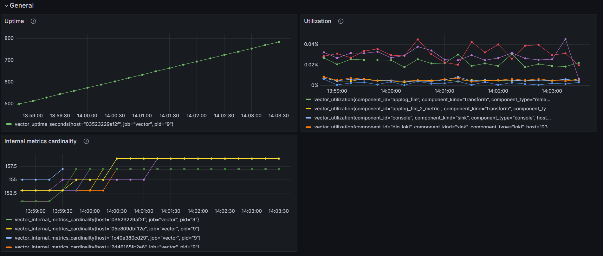
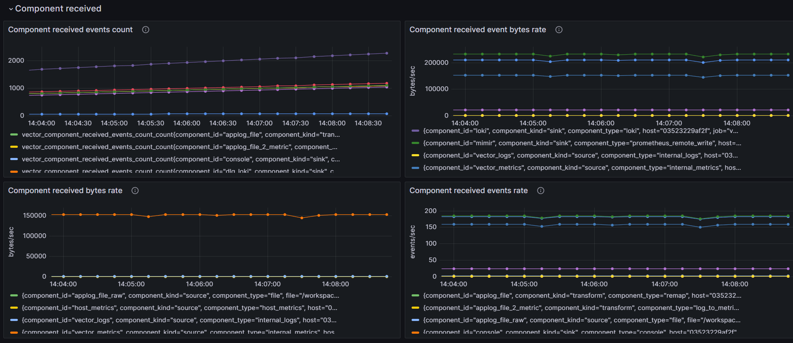
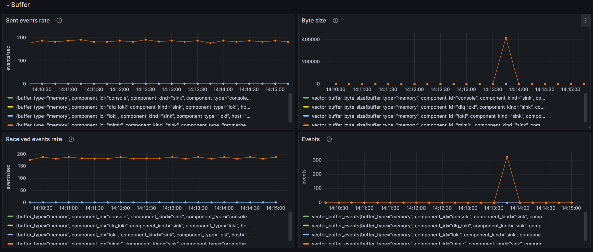
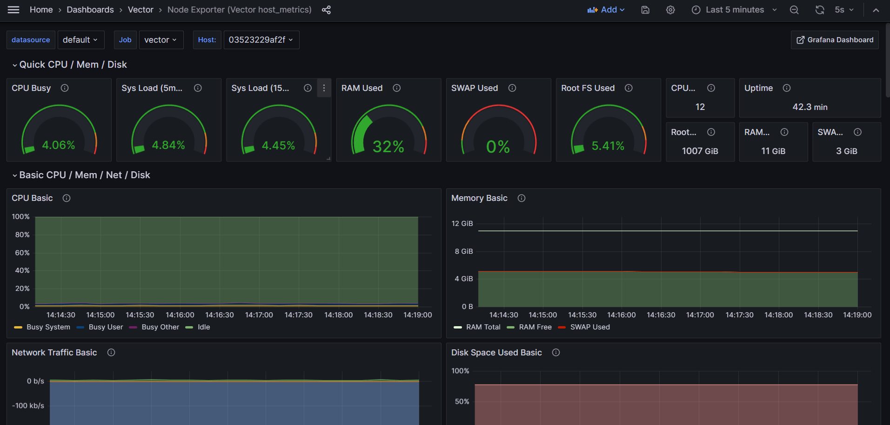

# 2023-11-23 #6 Vector in action

<iframe src="https://www.youtube.com/embed/gYoY9NCajbE?si=PDBytzC0ymNt6Ygm" title="Vector.dev Log_to_metric demo" frameborder="0" allow="accelerometer; autoplay; clipboard-write; encrypted-media; gyroscope; picture-in-picture; web-share" allowfullscreen></iframe>

[Last week, vector has been introduced](../2023-11-16_Meet_Vector/README.md). This week, this demo has been created including parsing, log to metric, vector agent monitoring and host metrics (Vector as a node exporter) .

## Run the demo

1️⃣ Clone the [repository](./)
- https://github.com/o11y-weekly/o11y-weekly.github.io/tree/main/2023-11-23_Vector_in_action

2️⃣ Run the script
```bash
./run.sh
```

3️⃣ Open Grafana Dashboards:
  - [Log to metric](http://localhost:3000/d/eEZIy984z/log-2-metric?orgId=1&refresh=5s)
  - [Agent Monitoring](http://localhost:3000/d/NzDtFbMVz/agent-monitoring?orgId=1&refresh=5s) : monitoring vector and pipelines
  - [Vector host_metrics](http://localhost:3000/d/rYdddlPWk/node-exporter-vector-host-metrics?orgId=1&refresh=5s): setup vector to replace a node exporter agent.

### Demo Components



The app contains 2 [supervisord](http://supervisord.org/) services: 
- [app.sh](./app/app.sh) writes logs to `LOG_BASE_PATH` (/workspace/app/log/). The log structure is 2 lines; `bad logs` is used as an invalid key value to monitor pipeline errors while the second one is parsed as a metric (H is hotel and T in the fake app think time part in milliseconds).
  
  10 [app.sh](./app/app.sh) instances is configured to show how the graph scale when the number of agent is high.
 ```bash
t=2023-11-20T11:34:15.692975421+00:00 bad logs
t=2023-11-20T11:34:15.694559072+00:00 H=2497  T=2725
```
- [vector](./app/supervisor/supervisor.d/vector.ini) reads the logs from the app and converts logs to metrics. [Vector is also monitored](http://localhost:3000/dashboards/f/e688f10d-a449-488d-9b9c-55a9b994144d/vector) and a grafana dashboard is available.

A mimir, loki and grafana are used as a backend to visualize datapoints.



## Log to metric convertion

To convert log to metrics, the log should be structured and correctly parsed. Vector component [Vector Remapping Language](https://vector.dev/docs/reference/vrl/) is used to parse line to structured log.

[VRL](https://vector.dev/docs/reference/vrl/) is a lightweight [rust](https://www.rust-lang.org/) which brings [safety](https://vector.dev/docs/reference/vrl/#safety) and true error handling to avoid runtime error when the error can be statically verified during writing the parser.

It helps to easily maintain transformations.

### Vector Remapping Language (VRL)
In this demo, the following VRL is used to parse the log line to a structured log.

The following part has been introduced on the [previous post](../2023-11-16_Meet_Vector/README.md).

```vrl
. |= parse_key_value!(.message, field_delimiter:"\t", accept_standalone_key:false)
.timestamp = parse_timestamp!(.t, "%Y-%m-%dT%H:%M:%S%.f%:z")
.job = "vector"
del(.message)
```

`.message` is the raw message which can be parsed.

1️⃣ parse message as key value and put the object at root level (dot) `.`. The parse_key_value returns a result which can be the object or an error. The bang `!` operator is used to fail on error.

2️⃣ Add a field `timestamp` by parsing and fail if there is an error

3️⃣ Add `job` field to vector

4️⃣ Remove `message` to avoid paying twice raw and structured signal.

/!\ This program will fail on error meaning that vector will stop on error.

It is also possible to handle errors in vrl but it comes at repeating the same error handling every time.

Instead of failing vector on error, it is also possible and recommended to drop on error so that vector will not fail at all and the message is not lost but rerouted.

### Log to Metric Transformation
#### Pipeline setup
Log to metric transformation in vector is a common pattern where logs are visualized as aggregated metrics only. Using logs as direct source to visualize is CPU and IO intensive and unefficient way to visualize datapoints.

To avoid high resource usage to simply visualize datapoints, a log to metric transformation can be used.

The log to metric demo pipeline: 

1️⃣ Setup source `app_file_raw`

2️⃣ Parse line to structured log by configuring the transforms vector remapping language (VRL) conversion [keyvalue.vrl](./vector/vrl/keyvalue.vrl). Drop on error, abort and reroute thoses messages to a drop input.

3️⃣ Setup the `log_to_metric` vector transforms by creating 2 counters: one incremented by log (`app.count`) and another one incremented by `T` value (`app.total`) which is the thinktime of the `app` component.

```toml
# file log
[sources.applog_file_raw]
type = "file"
include = ["${LOG_BASE_PATH}**/*.*"]

[transforms.applog_file]
type = "remap"
inputs = ["applog_file_raw"]
file = "config/vrl/keyvalue.vrl"
# forward to a dead letter queue on error or abort 
drop_on_error = true
drop_on_abort = true
reroute_dropped = true

[transforms.applog_file_2_metric]
type = "log_to_metric"
inputs = ["applog_file"]
[[transforms.applog_file_2_metric.metrics]]
type = "counter"
field = "T"
namespace = "app"
name = "count"
    [transforms.applog_file_2_metric.metrics.tags]
    hotel = "{{H}}"
[[transforms.applog_file_2_metric.metrics]]
type = "counter"
field = "T"
namespace = "app"
name = "total"
increment_by_value = true
    [transforms.applog_file_2_metric.metrics.tags]
    hotel = "{{H}}"
```

#### Vector test
Vector has the ability to unit test the transformation pipeline like the log 2 metric test.

```toml
[[tests]]
name = "Test applog_file parsing"

[[tests.inputs]]
insert_at = "applog_file"
type = "log" 

[tests.inputs.log_fields]
message = "t=2023-11-13T15:53:37.728584030+01:00\th=FR-LT-00410\tH=6666\tT=5663"

[[tests.outputs]]
extract_from = "applog_file"

[[tests.outputs.conditions]]
type = "vrl"
source = '''
assert!(is_timestamp(.timestamp))
'''
```

1️⃣ Substitute the input `applog_file` : the structured log.

2️⃣ Inject an entry `.message =2023-11-13T15:53:37.728584030+01:00\th=FR-LT-00410\tH=6666\tT=5663`

3️⃣ Intercept the pipeline output of `applog_file` to `test.outputs`

4️⃣ Assert the output with a [vrl]((https://vector.dev/docs/reference/vrl/)) assertion `assert!(is_timestamp(.timestamp))`.

5️⃣ Run the unit test

    ```bash
    docker run --rm -w /vector -v $(pwd):/vector/config/ timberio/vector:0.34.0-debian test --config-toml /vector/config/**/*.toml
    ```

A [vector_test.sh](./vector/vector_test.sh) script has been made to ease the vector integration.

#### Vector graph

Vector has a `graph` command which produces dot graph. A [vector_graph.sh](./vector/vector_graph.sh) is available to build this graph.

```bash
docker run --rm -w /vector -v $(pwd):/vector/config/ timberio/vector:0.34.0-debian graph --config-toml /vector/config/**/*.toml | dot -Tsvg > graph.svg
```



As soon as the pipeline run, it becomes important to monitor errors, saturation and utilization to properly trigger alerts.

## Vector monitoring

Vector is instrumented with logs and metrics.

Dedicated pipeline metrics are available and a [grafana dashboard](https://grafana.com/grafana/dashboards/19649-vector-monitoring/) is available.

For the sake of the demo, the dashboard is a lightweight version of the [full vector.dev](https://grafana.com/grafana/dashboards/19649-vector-monitoring/).

### Monitoring Pipeline errors and dropped messages

In this demo, on error, the log is dropped and it is possible to collect all dropped messages of the pipeline.

```toml
## dead letter queue for dropped messages
[sinks.dlq_loki]
type = "loki"
endpoint = "http://loki:3100"
inputs = ["*.dropped"]
encoding = { codec = "json" }
labels = { application = "dead-letter-queue", host="{{ host }}", pid="{{ pid }}" }
```



In this demo, a `bad logs` is not a key value and the pipeline fails so that this log appears in the dropped inputs. 

Vector produces such log on error which is helpful to analyze which component is failing(`"component_id": "applog_file"`), the error message(`"message": "function call error for \"parse_key_value\" at (5:82): could not parse whole line successfully"`) and the full log message(`"message": "t=2023-11-23T13:00:14.872126641+00:00\tbad logs"`)

```json
{
  "file": "/workspace/app/log/03523229af2f_20231123.log",
  "host": "03523229af2f",
  "message": "t=2023-11-23T13:00:14.872126641+00:00\tbad logs",
  "metadata": {
    "dropped": {
      "component_id": "applog_file",
      "component_kind": "transform",
      "component_type": "remap",
      "message": "function call error for \"parse_key_value\" at (5:82): could not parse whole line successfully",
      "reason": "error"
    }
  },
  "source_type": "file"
}
```

### Monitoring pipeline performance and usage

The `Utilization` graph helps to monitor components utilization to quickly identify a component using too much resources. 



Sinks and sources components bandwidth is monitored through `Component sent` and `Component received`



[Buffer](https://vector.dev/docs/about/under-the-hood/architecture/buffering-model/) Events is also important to care, in case of problem on the sink side, the number of events can be high and it is important to check that there is no dropped telemetry due to a sink problem.



## Vector as Node exporter

Vector can also be used as a drop-in solution of [node exporter](https://github.com/prometheus/node_exporter) to reduce the number of agent per host.

This [grafana graph](https://grafana.com/grafana/dashboards/19650-node-exporter-vector-host-metrics/) has been imported and vector has been configured to export host metrics.

