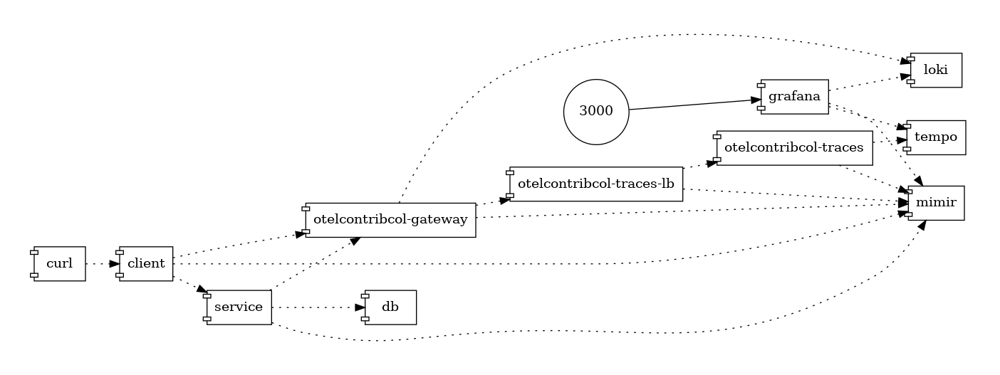

# Deep Dive Demo
## Disclaimer
⚠️This demo is not a grafana labs production ready demo and used as local dev hands on and demo only.

Security, scalling and so on will not be introduced and GrafanaCloud offers the best experience and a no brainer solution to start with.

<iframe src="https://www.youtube.com/embed/wf6pPtyTSj4?si=ah7DXmtIBknR1thI" title="OpenTelemetry LGTM demo" frameborder="0" allow="accelerometer; autoplay; clipboard-write; encrypted-media; gyroscope; picture-in-picture; web-share" allowfullscreen></iframe>

## Architecture

This demo includes 2 java services (service and client) and a postgres database to use webserver and jdbc instrumentations.

[OpenTelemetry Collector Contrib](https://github.com/open-telemetry/opentelemetry-collector-contrib) has been used as a [Gateway](https://opentelemetry.io/docs/collector/deployment/gateway/) and [Agent](https://opentelemetry.io/docs/collector/deployment/agent/)



## Run locally

### Run the docker compose
```bash
git clone git@github.com:o11y-weekly/o11y-weekly.github.io.git
cd o11y-weekly.github.io/2024-01-31_OpenTelemetry_Looks_Good_To_Me/demo/
./up.sh
```
### Run Grafana
Open Grafana: http://localhost:3000

2 folders:
- App: contains app dashboards
- OpenTelemetry Collector Contrib: Agent and Gateway monitoring

## Grafana Dashboards

### Java

1 Java dashboards are available:
- [OpenTelemetry JVM Micrometer](https://grafana.com/grafana/dashboards/20352-opentelemetry-jvm-micrometer/)

### OpenTelemetry Collector Monitoring

- [OpenTelemetry Collector Contrib pipeline monitoring](./grafana/provisioning/dashboards/OpenTelemetry%20Collector%20Contrib/OpenTelemetry%20Collector.json)

- [OpenTelemetry Collector Contrib node exporter drop-in](https://grafana.com/grafana/dashboards/20376-opentelemetry-collector-hostmetrics-node-exporter/)

## Deep Dive

### Java Instrumentation setup

#### Automatic instrumentation
Reference : [Automatic instrumentation](../../2023-11-30_What_is_OpenTelemetry/README.md#automatic)

#### Manual instrumentation
Reference : [Manual instrumentation](../../2023-11-30_What_is_OpenTelemetry/README.md#manual)


#### Setup Metrics instrumentation and exporter

Micrometer combined with the otlp registry has been used to push metrics with OTLP to mimir:

[Client pom micrometer otlp dependency](./client/pom.xml)
```xml
<dependency>
    <groupId>io.micrometer</groupId>
    <artifactId>micrometer-registry-otlp</artifactId>
</dependency>
```

[Client application.yml](./client/src/main/resources/application.yml)
```yaml
management:
  otlp:      
    metrics:
      export:
        enabled: true
        step: 10s
        url: http://mimir:9009/otlp/v1/metrics
        # url: https://prometheus-prod-24-prod-eu-west-2.grafana.net/otlp/v1/metrics
        # headers:
        #   Authorization: Basic ####

  metrics:
    tags:
      deployment.environment: '${deployment.environment}'
      host.name: '${host.name}'
      service:
        name: '${service.name}'
        namespace: '${service.namespace}'
        version: '@project.version@'
    distribution:
      slo:
        http: 5, 10, 25, 50, 75, 100, 250, 500, 750, 1000, 2500, 5000, 7500, 10000
        jvm: 5, 10, 25, 50, 75, 100, 250, 500, 750, 1000, 2500, 5000, 7500, 10000
```

#### Logs
2 different methods has been used to send logs to LOKI.

Scrapping the file is a conventional and standard method to seng logs with a agent and used in the [service application](./service/) while [pushing logs to a gateway] is quite new and used in the [client application](./client/).

##### File Log

In the [service application](./service/), Logback has been used to write the logs into a file log.

[Logback service configuration](./service/src/main/resources/logback.xml)

```xml
<?xml version="1.0" encoding="UTF-8"?>
<configuration>
    <property resource="application.yml" />

    <appender name="CONSOLE" class="ch.qos.logback.core.ConsoleAppender">
        <encoder>
            <pattern>%d{HH:mm:ss.SSS} [%thread] %-5level %logger{36} - %msg%n</pattern>
        </encoder>
    </appender>

    <appender name="FILE" class="ch.qos.logback.core.FileAppender">
        <file>log/${SERVICE_NAME}.log</file>
        <append>true</append>
        <encoder>
            <pattern>timestamp=%d{yyyy-MM-dd'T'HH:mm:ss.SSSXXX}\tservice.version=${service.version}\ttraceId=%X{trace_id}\tspanId=%X{span_id}\tmessage=%msg%n</pattern>
        </encoder>
    </appender>

    <root level="INFO">
        <appender-ref ref="CONSOLE" />
        <appender-ref ref="FILE" />
    </root>
</configuration>
```

OpenTelemetry Collector contrib reads the file and forward logs to LOKI using the LOKI api.


##### Java Agent exporter

In the [client application](./client/) the Java agent sends log with OpenTelemetry embedded exporters.

Java agent command line ([app command line](./client/supervisor.d/app.ini)) :
```ini
[program:app]
command=java
    -javaagent:/app/opentelemetry-javaagent.jar
    -Dservice.name=%(ENV_SERVICE_NAME)s
    -Dservice.namespace=%(ENV_SERVICE_NAMESPACE)s
    -Dhost.name=%(host_node_name)s
    -Ddeployment.environment=%(ENV_DEPLOYMENT_ENVIRONMENT)s
    -Dotel.resource.attributes=service.name=%(ENV_SERVICE_NAME)s,service.namespace=%(ENV_SERVICE_NAMESPACE)s,deployment.environment=%(ENV_DEPLOYMENT_ENVIRONMENT)s,host.name=%(host_node_name)s
    -jar /app/main.jar 
    --spring.application.name=%(ENV_SERVICE_NAME)s 
```

#### Traces
WithSpan attribute

##### Java Agent

### OpenTelemetry Collector

#### Agent
- [Agent Configuration](./otelcontribcol/agent/)

#### Gateway
- [Gateway Configuration](./otelcontribcol/gateway/)

#### Traces Tail Sampling

Traces Tail sampling [configuration](./otelcontribcol/traces-collector/pipeline.traces.yml):

```yaml
processors:
  tail_sampling/latency-error:
    decision_wait: 10s
    policies:
      [
        # skip traces where latencies are < 100ms
        {
          name: latency-policy,
          type: latency,
          latency: {threshold_ms: 100}
        },
        # keep only error traces by skipping 4XX errors
        {
          name: error-policy,
          type: and,
          and:
            {
              and_sub_policy:
                [
                  {
                    name: status_code-error-policy,
                    type: status_code,
                    status_code: {status_codes: [ERROR]}
                  },
                  # exclude false positive like bad requests or not found
                  {
                    name: http-status-code-error-policy,
                    type: string_attribute,
                    string_attribute:
                      {
                        key: error.type,
                        values: [4..],
                        enabled_regex_matching: true,
                        invert_match: true,
                      },
                  },
                ]
            }
        }
      ]
```

## OpenTelemetry Collector Contrib setup

### Metrics
- Instrumentation: micrometer with otlp registry
- Collector: No Collector

### Logs
#### Agent mode
Inside the service container, supervisord is used to run the agent like a kubernetes sidecar.

- Instrumentation: manual with logback and a file log
- Collector: [OpenTelemetry Collector Contrib](https://github.com/open-telemetry/opentelemetry-collector-contrib/)
 [Agent](https://opentelemetry.io/docs/collector/deployment/agent/) which scrape the log file and send logs to loki.

OpenTelemetry Collector Agent [configuration](./otelcontribcol/agent/pipeline.app.yaml)
```yaml
receivers:
  filelog/app:
    include: [ /app/log/*.log ]
    storage: file_storage/app
    multiline:
      line_start_pattern: timestamp=
    operators:
      - type: key_value_parser
        delimiter: "="
        pair_delimiter: "\t"
      - type: move
        from: attributes["service.version"]
        to: resource["service.version"]
      - type: move
        from: attributes.message
        to: body
      - type: time_parser
        parse_from: attributes.timestamp
        layout_type: strptime
        layout: "%Y-%m-%dT%H:%M:%S.%LZ" #2024-04-11T12:39:13.402Z
      - type: remove
        field: attributes.timestamp
      - type: trace_parser
        trace_id:
          parse_from: attributes.traceId
        span_id:
          parse_from: attributes.spanId
      - type: remove
        field: attributes.traceId
      - type: remove
        field: attributes.spanId
    resource:
      service.name: ${env:SERVICE_NAME}
      service.namespace: ${env:SERVICE_NAMESPACE}
      host.name: ${env:HOSTNAME}
      deployment.environment: ${env:DEPLOYMENT_ENVIRONMENT}

processors:
  batch/app:

service:
  pipelines:
    logs/app:
      receivers: [filelog/app]
      processors: [batch/app]
      exporters: [otlphttp/gateway/loki, debug]
```

#### No Collector mode
Inside the client app.
- Instrumentation: [OpenTelemetry Java Agent](https://github.com/open-telemetry/opentelemetry-java-instrumentation)
- Collector: [OpenTelemetry Collector Contrib](https://github.com/open-telemetry/opentelemetry-collector-contrib/)
 [Gateway](https://opentelemetry.io/docs/collector/deployment/gateway/) which sends otlp logs to loki

Gateway [configuration](./otelcontribcol/gateway/pipeline.logs.yml) to collect logs.

```yaml
processors:
  batch/loki:
service:
  pipelines:
    logs/gateway:
      receivers: [otlp/gateway]
      processors: [batch/loki]
      exporters: [otlphttp/gateway/loki]```

## OpenTelemetry Collector Contrib Monitoring

### HostMetrics (node exporter)

Push host metrics to mimir

[OpenTelemetry Collector HostMetrics configuration](./otelcontribcol/gateway/pipeline.agent.yml)
```yaml
exporters:
  debug:
    verbosity: detailed
  otlphttp/gateway/mimir:
    endpoint: http://mimir:9009/otlp

receivers:
  # otelcontribcol metrics + host metrics
  prometheus/gateway:
    config:
      scrape_configs:
        - job_name: otelcol-contrib/gateway
          scrape_interval: 10s
          static_configs:
            - targets: [0.0.0.0:8888]
  hostmetrics/gateway:
    collection_interval: 10s
    scrapers:
      cpu:
        metrics:
          system.cpu.logical.count:
            enabled: true
      memory:
        metrics:
          system.memory.utilization:
            enabled: true
          system.memory.limit:
            enabled: true
      load:
      disk:
      filesystem:
        metrics:
          system.filesystem.utilization:
            enabled: true
      network:
      paging:
      processes:
      process:
        mute_process_user_error: true
        metrics:
          process.cpu.utilization:
            enabled: true
          process.memory.utilization:
            enabled: true
          process.threads:
            enabled: true
          process.paging.faults:
            enabled: true

processors:
  batch/gateway:
  attributes/gateway:
    actions:
      - key: service.namespace
        action: upsert
        value: gateway
      - key: service.name
        action: upsert
        value: otelcol-contrib/gateway
  resourcedetection/system:
    detectors: ["system"]
    system:
      hostname_sources: ["os"]
  transform:
    metric_statements:
      - context: datapoint
        statements:
          - set(attributes["host.name"], resource.attributes["host.name"])
          - set(attributes["process.command"], resource.attributes["process.command"])
          - set(attributes["process.command_line"], resource.attributes["process.command_line"])
          - set(attributes["process.executable.name"], resource.attributes["process.executable.name"])
          - set(attributes["process.executable.path"], resource.attributes["process.executable.path"])
          - set(attributes["process.owner"], resource.attributes["process.owner"])
          - set(attributes["process.parent_pid"], resource.attributes["process.parent_pid"])
          - set(attributes["process.pid"], resource.attributes["process.pid"])


service:
  telemetry:
    metrics:
      level: detailed
    logs:
      level: info

  pipelines:
    metrics/gateway:
      receivers: [prometheus/gateway, hostmetrics/gateway]
      processors: [attributes/gateway, resourcedetection/system, transform, batch/gateway]
      exporters: [otlphttp/gateway/mimir]
```

### Pipeline

Detailed metrics are providen from OpenTelemetry Collector which should be activated:

[Telemetry service for OpenTelemetry Collector](./otelcontribcol/agent/pipeline.agent.yaml)
```yaml
service:
  telemetry:
    metrics:
      level: detailed
    logs:
      level: info
```