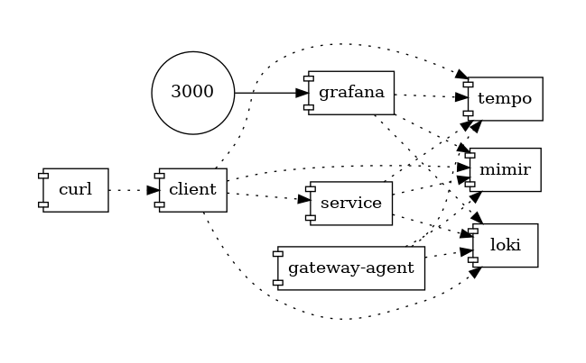

# Demo
## Disclaimer
⚠️This demo is not a grafana labs production ready demo and used as local dev hands on and demo only.

Security, scalling and so on will not be introduced and GrafanaCloud offers the best experience and a no brainer solution to start with.

## Architecture

This demo include 2 java services and a postgres database to use webserver and jdbc instrumentations.

[OpenTelemetry Collector Contrib](https://github.com/open-telemetry/opentelemetry-collector-contrib) has been used as a [gateway](https://opentelemetry.io/docs/collector/deployment/gateway/)




## Run locally

### Run the docker compose
```bash
./up.sh
```

## Run Grafana
Open dashboard: http://localhost:3000

