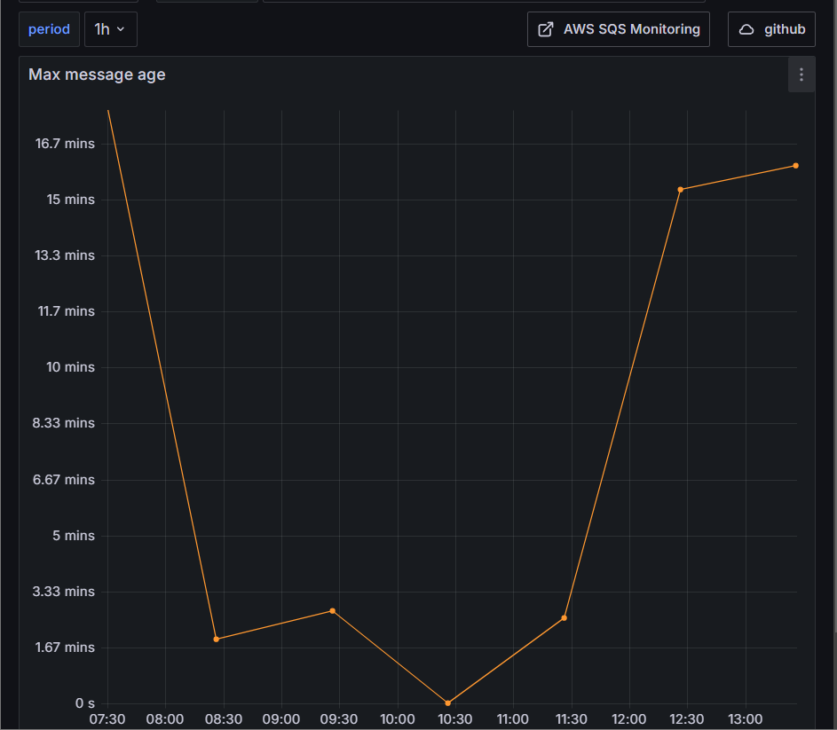

# Using CloudWatch backend and Grafana

SAAS AWS products (SQS, Lambda, API Gateway, S3 ...) offers monitoring with CloudWatch by default. Creating new resources ready to go to production and monitor is easy.

CloudWatch can be see as: 

1/ An Observability backend

2/ A Front end: when using CloudWatch from the AWS console.

Let's introduce Grafana as an observability front end used with CloudWatch as a backend.

As mentioned, Grafana does only one thing: an observability front end which is compatible with lots of Observability Backends.

It is quite common to use multiple AWS account per project and having a 360 degree observability from development to production for any applications is important as a company.

Grafana can be configured to use multiple CloudWatch datasources from multiple account which ease the 360 degree observability as a company.

Grafana contributed to the CloudWatch datasource where dashboards example can be found directly on the [grafana repository](https://github.com/grafana/grafana/tree/main/public/app/plugins/datasource/cloudwatch/dashboards) which are also available when adding the cloudwatch datasource as below:


While the quicksetup is really useful, here are the best practices to properly use the CloudWatch Logs and Metrics API in Grafana.

## CloudWatch Logs

References:
[CloudWatch Query Language](https://docs.aws.amazon.com/AmazonCloudWatch/latest/logs/CWL_QuerySyntax.html)

### Simple demo
Here is a simple demo where logs are fetched using [CloudWatch Log Query](https://docs.aws.amazon.com/AmazonCloudWatch/latest/logs/CWL_QuerySyntax.html). 


```
fields @timestamp, @message
| sort @timestamp desc
| display @timestamp, concat(httpMethod, " ", protocol, " ", ip, " " ,status, " ", path), @message
```
### Best Practices
#### Setup datasource variable
Switching CloudWatch datasource (1 datasource per account) should be easy and Grafana dashboards can be configured to support multiple datasouce.

A datasource template variable should be configured and used in all Grafana CloudWatch query

##### Configure the variable


##### Use the datasource variable in query


#### Setup region variable
If aws resources are deployed in multiple region, dashboard should be configurable to switch from one region to another like for the datasource.

##### Configure the variable


##### Use the region variable in query


#### Log groups template
As mentioned before, creating dashboards supporting multiple aws account is an important feature to support 360 degree observability and monitoring.

From CloudWatch point of view, applications are sending logs to CloudWatch which are organized in log groups which can be different from an account to another.


#### Setup period variable
This variable helps to visualize more or less detailed graph by choosing the aggregation period (graph resolution) which is usually from 1 minutes up to days.
| 1mn resolution | 1h resolution |
|-|-|
|||

##### Configure the variable


##### Use the period variable in query


#### Dashboard Template
##### Create log group template variable
To do so, Grafana Logs should use a template variable to choose the right log group for the matchin aws cloudwatch datasource (per account).


##### Use Log group variable in vizualisation query
In the grafana log vizualisation, in datasource, select log groups


## CloudWatch Metrics
2 APIs are available to query CloudWatch metrics

### Simple Demo
TODO

### Metrics Search API
References:
- [CloudWatch Search expressions](https://docs.aws.amazon.com/AmazonCloudWatch/latest/monitoring/using-search-expressions.html)
- [CloudWatch Metric Math](https://docs.aws.amazon.com/AmazonCloudWatch/latest/monitoring/using-metric-math.html)

AWS resources comes with CloudWatch Metrics by default to allow monitoring resources like SQS, Lambda, ...

Search expressions and Metric Math are the default queries used to get metrics for a specific resource.

Here is an example using Search expressions for SQS:
```
DIFF(SEARCH(' {AWS/SQS, QueueName} MetricName="ApproximateNumberOfMessagesVisible" QueueName="my-queue.fifo"', 'Maximum'))
```

Those queries can be found directly from CloudWatch and copied inside Grafana.

### Metrics Insights API
Reference:
- [Query your metrics with CloudWatch Metrics Insights](https://docs.aws.amazon.com/AmazonCloudWatch/latest/monitoring/query_with_cloudwatch-metrics-insights.html)

This is the latest API available which is compatible with SQL and requires less knowledge about quering CloudWatch metrics.

Pay Attention that this API has know limits: [Metrics Insights limits](https://docs.aws.amazon.com/AmazonCloudWatch/latest/monitoring/cloudwatch-metrics-insights-limits.html)

### Pros / Cons
| API | Pros | Cons |
|-|-|-|
| Metrics Search | Mature | Query Syntax |
| Metrics Insights | Query Syntax (SQL) | Limits |

While Metrics Insights is very promising, be sure to query for different time range to be sure that this API fits with the need.

## Billing observability with CloudWatch
Reference: [AWS Billing Alarm](https://docs.aws.amazon.com/AmazonCloudWatch/latest/monitoring/monitor_estimated_charges_with_cloudwatch.html#creating_billing_alarm_with_wizard)

The CloudWatch US East (N. Virginia) Region host a special namespace where Billing can be observed.

Bringing such dashboards can helps teams to support the "You Build It, You Run It and You Pay for it".

A [grafana dashboard](https://grafana.com/grafana/dashboards/20288-aws-multi-account-billing/) is available to quickly setup the Grafana instance by provisionning the Billing dashboard.

## Grafana Dashboards
Here are dashboards using the best pratices for observability to monitor AWS resources:

- [API Gateway (logs and metrics)](https://grafana.com/grafana/dashboards/20796-aws-api-gateway-cloudwatch-logs-metrics/)
- [AWS Lambda Insights (logs and metrics)](https://grafana.com/grafana/dashboards/19734-aws-lambda-insights/)
- [SQS](https://grafana.com/grafana/dashboards/20042-aws-sqs-cloudwatch/)
- [Keyspaces](https://grafana.com/grafana/dashboards/19699-aws-cassandra/)
- [AWS Account Billing](https://grafana.com/grafana/dashboards/20288-aws-multi-account-billing/)